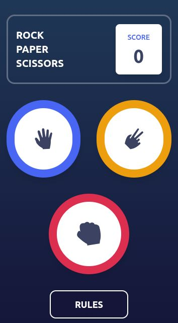
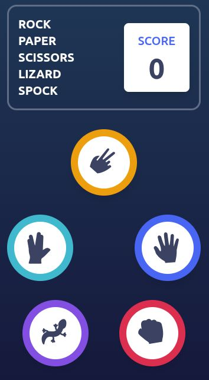
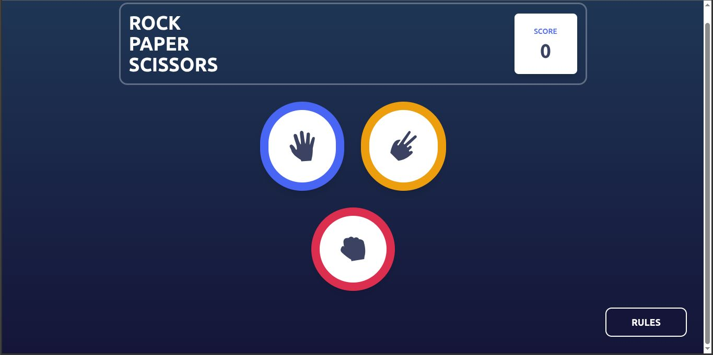
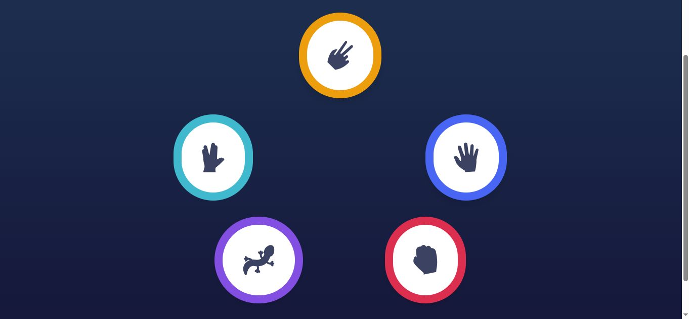

# Frontendmentor Challenge - Rock Paper Scissors
The challenge is to create an app that can work as a rock paper scissors game, the difficulty was to choose but personally I wanted to make it in both difficulties to have more challenge.

## Technologies
- HTML
- CSS
- Javascript
- React
- Tailwindcss

## Screenshots

  

      
 Mobile - Normal Game

      
      
 Mobile - Hard Game

      
  

  

      
 Desktop - Normal Game

      
      
 Desktop - Hard Game

      
  

## Characteristics
- Two selectable difficulty levels
- Button to read the rules and regulations
- Game in perfect working order
- Scoreboard
- Button to go back and choose another difficulty

## Links
- Frontendmentor (https://www.frontendmentor.io)
- My portfolio (https://gaston-gomez1997.netlify.app/)
